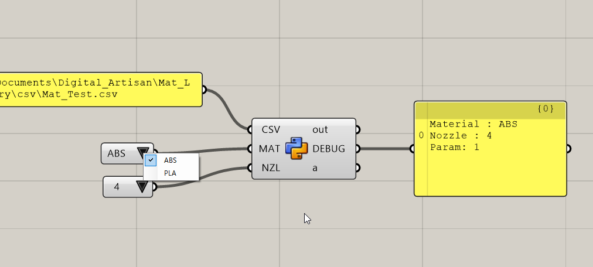

# Mat_Library  

マテリアルによって定まる変数を管理する。  

マテリアル関連は、ライブラリとして皆が同一のものにアクセスできるのが嬉しいので、参照元の設定値はサーバ上にあるのがベストだと思う。  

Spreadsheet API 等、非常にめんどくさそうなので、次点で csv ファイルかな。  

  

### Value List Component  

地味に使いどころがわからない Value List Component を使ってなんちゃって UI を作成。  

Value List Component からは、インデックスの値しか取り出せないので、CSV の探索の前に、インデックスと名称の復元が必要になる。  

### Ref  

- PythonでCSVファイルを読み込み・書き込み（入力・出力）（note.nkmk.me）  
  [https://note.nkmk.me/python-csv-reader-writer/](https://note.nkmk.me/python-csv-reader-writer/)  

- 全人類に告ぐ。セル結合をやめろ。(hibitの技術系メモ)  
  [https://deux-hibi.hatenablog.com/entry/2018/12/09/020957](https://deux-hibi.hatenablog.com/entry/2018/12/09/020957)  

